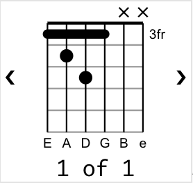

# Music Markdown

[](https://travis-ci.com/music-markdown/music-markdown)

Hosted at [music-markdown.github.io](https://music-markdown.github.io).

## Intro

Music Markdown is a Web App that renders markdown with embedded music from files in GitHub:


Features:

- Full support for Markdown syntax using [markdown-it](https://markdown-it.github.io/).
- Custom syntax for rendering phrases of lyrics and chords.
- Rendering support for:
  - Multiple columns
  - [Guitar chord diagrams](https://www.guitar-chord.org/chart.html)
  - [ABC music notation](https://en.wikipedia.org/wiki/ABC_notation)
  - [VexTab music notation](http://vexflow.com/vextab/)
- Read and write Music Markdown files from your own GitHub repository.
  - Automatically convert existing guitar tablature to Music Markdown.
- Rehearse along with YouTube videos.
- [Transpose music](<https://en.wikipedia.org/wiki/Transposition_(music)>) up and down.
- Autoscroll to allow rehearsal without manual scrolling

## Mission Statement

Our goal is to provide a tool that enables bands to be able to rehearse together. The source is freely available and released in the unencumbered ISC license.

Music Markdown is a toil of love. We are aware that it is not as easy to use as it could be, but we're working on it, and we would gratefully accept feature suggestions and source contributions.

## Users Guide

Music Markdown is [hosted on GitHub](https://music-markdown.github.io) and the web app reads music markdown files from GitHub repositories. This enables bands to have their own repositories of music that they maintain for themselves.

### Setup

#### Pre-requisites

To use Music Markdown, you will need:

- A GitHub account - [sign up](https://github.com/join).
- A GitHub repository - [instructions](https://help.github.com/en/github/getting-started-with-github/create-a-repo).

#### Adding a Repository

1. Go to [Music Markdown](https://music-markdown.github.io).
1. Click on the **+** button at the bottom right.
1. In the **Add Repository** dialog box, fill in the:
   - Repository Owner - typically, your user name.
     - E.g. `music-markdown`
   - Repository Name - this is the name of the repository you created in the previous section.
     - E.g. `almost-in-time`
1. Click **Add**.

Note: You can use our `music-markdown/almost-in-time` to try out the web app, but be aware that you will not be able to add or edit files in this repository.

#### Enabling Write Access

Currently, Music Markdown uses GitHub tokens to gain access to write to GitHub repositories.

**Warning: GitHub tokens are very sensitive. If someone gains access to your GitHub token, they will gain write access to any repository that you have access to. Furthermore, Music Markdown stores the token in plain text in your browser's local storage. Please be cautious if you decide to use this feature.**

1. Go to GitHub [Personal access tokens](https://github.com/settings/tokens).
1. Click **Generate new token**.
1. Under **Note**, type a name for the token, for example, `Music Markdown`.
1. Under **scopes** grant **repo** permissions.
1. Scroll to the bottom and click **Generate token**.
1. Copy the token to the clipboard.
1. Go to [Music Markdown](https://music-markdown.github.io).
1. Click the **Settings gear** in the top right.
1. Click **Set GitHub Token** in the menu.
1. Paste the token.
1. Click **Save**.

### Composing Music Markdown

#### Creating a new File

1. Go to [Music Markdown](https://music-markdown.github.io).
1. Click the repository you configured in the Setup section.
1. Click the **master** branch.
1. Click the **+** button at the bottom right.
1. In the **Create New Music Markdown File** dialog, type a name for the new file.
1. Click **Create**.

This will create a new Music Markdown file and take you to the editor.

#### Basic Syntax

The basic syntax of Music Markdown is, as you might expect, markdown. We use the markdown-it library, so anything that markdown-it supports, we support as well.

##### Phrase

A lyric and chord phrase is formatted as a sequence of lines, each prefixed with a letter and a number, called a voice.

The prefix letter `c` has the special meaning of marking chord voice. All other letters have no special meaning. Typically, we use the prefix letter `l` to identify lyric voices.

A single phrase would be formatted as follows:

```music-markdown
c1:                    Am
l1: All the leaves are brown
```

In this case, the "Am" chord is attached to the lyric "brown".

##### Verses

A verse consists of multiple phrases. Each phrase is separated by one or more empty lines, for example:

```music-markdown
c1:                    Am     G  F          G      Esus4  E
l1: All the leaves are brown        and the sky is gray

c1: F               C     E  Am       F        Esus4  E
l1: I've been for a walk         on a winter's day
```

##### Voices

So far, we've seen exactly two voices per phrase, however, we can have as many voices as we want:

```music-markdown
c1: Dm                    Am                G
l2: They don't know how   long it  takes
l1:            They don't know how long  it takes
```

In this case, we have two lyric voices and one chord voice. Music Markdown will render each voice with its own color making it easier to distinguish each voice during rehearsal.

#### Advanced Syntax

##### Attaching YouTube Videos

To attach a YouTube video to a Music Markdown file:

1. Find the YouTube video you want to attach.
1. Copy the video ID from the URL (this is the text following the `v=`).
1. Add `youTubeId: <video ID>` to the header (in between the pair of `---`).

Example:

```music-markdown
---
youTubeId: acvIVA9-FMQ
---
```

##### Enable autoscroll

To configure autoscroll to a Music Markdown file:

1. Add `autoScroll: <pauseBeforeScrollInSeconds>,<pixelsToScrollPerSecond>` to the header (in between the pair of `---`).

Example 1 (progress scroll 10px per second):

```music-markdown
---
autoScroll: 0,10
---
```

Example 2 (pause for 5 seconds then progress scroll 9px per second):

```music-markdown
---
autoScroll: 5,9
---
```

##### Custom Chord Diagrams

Chord diagrams for chord symbols can be customized using our voicing notation.

Custom chord diagrams are specified in the `chords` section of the header (in between the pair of `---`). Each custom chord symbol should be associated with one or more voicings.

The voicing notation consists of a sequence of the following commands separated by spaces:

|  Command | Name   | Description                                                                                                                                                                                                                                                             |
| -------: | ------ | ----------------------------------------------------------------------------------------------------------------------------------------------------------------------------------------------------------------------------------------------------------------------- |
|     `o#` | Offset | Offsets the chord diagram. This command takes a single integer argument that indicates the offset from the head of the guitar.                                                                                                                                          |
|     `m#` | Mute   | Marks a string as muted (marked with an x). This command takes a single integer argument which will mark that string as muted.                                                                                                                                          |
|   `n#,#` | Note   | Marks a string to be played at a given fret. This command takes two integer arguments, the first of which indicates the string, and the second indicates the fret.                                                                                                      |
| `b#,#,#` | Barre  | Marks a set of strings that should be barred at a given fret. This command takes three integer arguments, the first and second of which mark the first and last string over which to apply the barre, and the third of which indicates on which fret to play the barre. |

Example:

In this example, we will render the following `Gdim` custom chord diagram:



This is rendered with the following custom chord diagram syntax:

```music-markdown
---
chords:
  Gdim:
    - o3 b1,4,3 n2,4 n3,5 m5 m6
---
```

The voicing string `o3 b1,4,3 n2,4 n3,5 m5 m6` should be interpreted as follows:

|  Command | Description                                                      |
| -------: | ---------------------------------------------------------------- |
|     `o3` | The chord diagram should be rendered starting from the 3rd fret. |
| `b1,4,3` | The 1st through 4th strings should be barred on the 3rd fret.    |
|   `n2,4` | The 2nd string should be played on the 4th fret.                 |
|   `n3,5` | The 3rd string should be played on the 5th fret.                 |
|     `m5` | The 5th string should be rendered muted (marked with an x).      |
|     `m6` | The 6th string should be rendered muted.                         |

##### ABC Notation

ABC notation can be added to a Music Markdown file by fencing it off in a `:::abc` block. For example, the following will render the C major scale:

```music-markdown
:::abc
C D E F G A B c
:::
```

We use the [abcjs](https://www.abcjs.net/) library to render ABC notation. See the [ABC documentation](https://abcnotation.com/) for the full syntax specification.

##### VexTab Notation

VexTab notation can be added to a Music Markdown file by fencing it off in a `:::vextab` block. For example:

```music-markdown
:::vextab
options space=20

tabstave
  notation=true
  key=A time=4/4

  notes :q =|: (5/2.5/3.7/4) :8 7-5h6/3 ^3^ 5h6-7/5 ^3^ :q 7V/4 |
  notes :8 t12p7/4 s5s3/4 :8 3s:16:5-7/5 :h p5/4
  text :w, |#segno, ,|, :hd, , #tr
:::
```

See the [VexTab tutorial](http://vexflow.com/vextab/tutorial.html) to learn how to write VexTab code.

## Developers Guide

To get started developing for Music Markdown, do the standard stuff:

1. Clone the repo:

   ```bash
   git clone https://github.com/music-markdown/music-markdown.git
   ```

1. Install the dependencies:

   ```bash
   cd music-markdown
   npm install
   ```

1. Start the dev server:

   ```bash
   npm start
   ```

### Recommended Plugins for Visual Studio Code

- ESLint
- Jest
- Prettier - Code formatter
